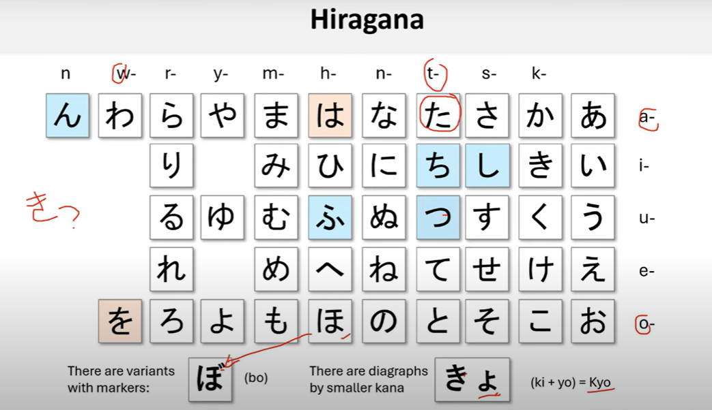
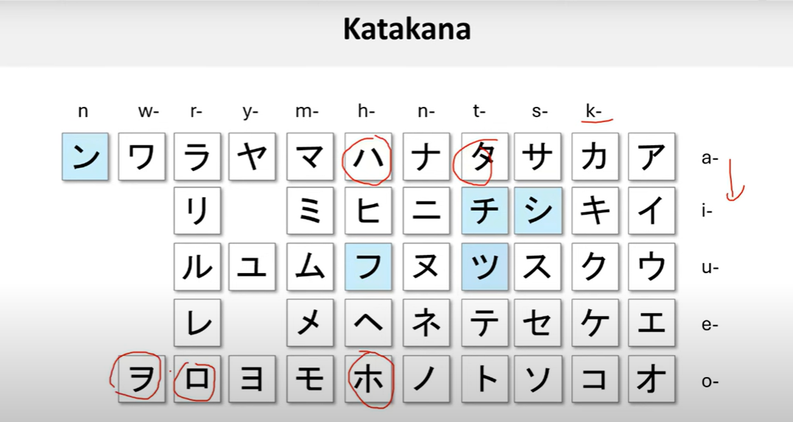
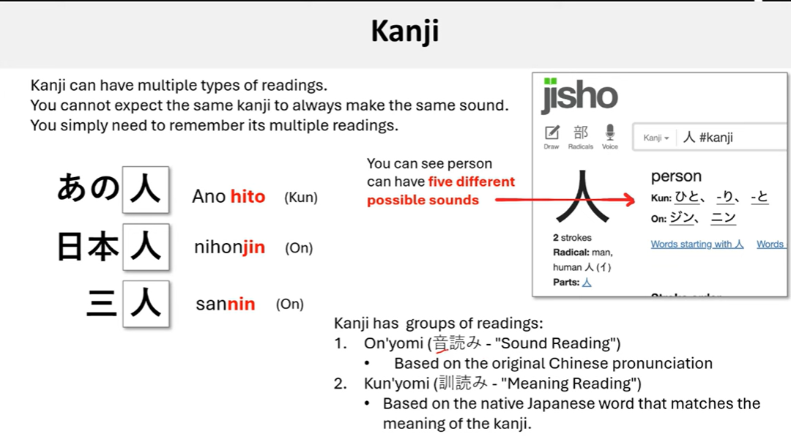
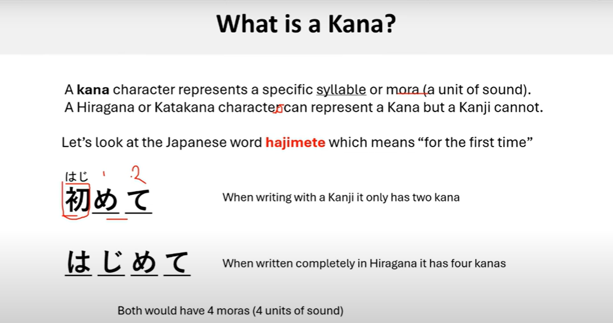
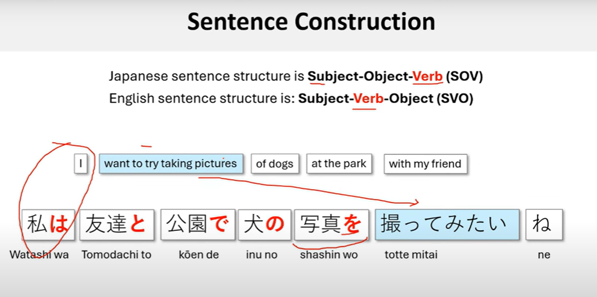
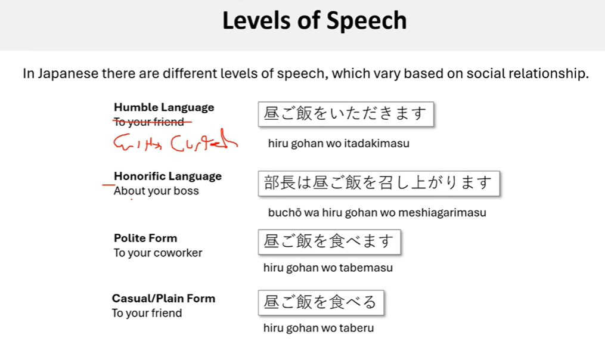

Hiranga - Native words
Katakana - Represents foriegn loadwords, technical terms, onomatopoeia, and for emphasis.
Kanji - Borrowed Chinese characters
Romanji - represntation of japanese sounds using the latin alphabet

